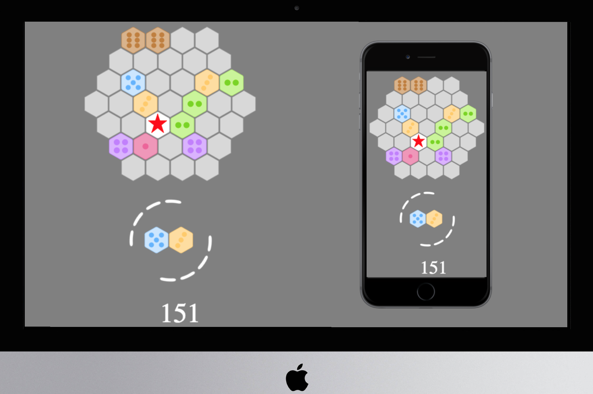

# Hetris

* A responsive canvas game inspired by Tetris and 2048 on a hex board
* Use BFS algorithm to find connected hexes which may collapse
* Top 10 scores powered by RESTful API and PostgreSQL database

Check it out for yourself - [Hetris](https://hetris.herokuapp.com/)!



## Install

```sh
npm install
nodemon
```

## Build client

```sh
npm run build
mv main.bundle.js ./static
```

## Key Technologies

* Node
* Express
* PostgreSQL
* Bootstrap
* HTML, CSS, JavaScript
